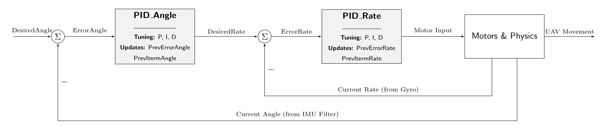

# Angle_MODE_UAV_ESP32

A custom ESP32 flight controller designed for Angle Mode stabilized flight, featuring a 200Hz control loop and cascaded PID implementation.

## Hardware & Wiring

This setup relies on specific SPI and I2C sensors. 
*   **Microcontroller:** ESP32
*   **IMU:** ICM20602 (SPI)
*   **Barometer:** BMP388 (I2C)
*   **Receiver:** SBUS compatible

**Pin Mapping:**
*   **Pin 27:** ESC Front Right
*   **Pin 25:** ESC Front Left
*   **Pin 33:** ESC Back Right
*   **Pin 26:** ESC Back Left
*   **Pin 35:** SBUS RX
*   **Pin 14:** Buzzer

*(Note: Link your June 2026 Mạch PCB design and flight testing videos here so others can see the physical board in action!)*

## Control Architecture

This flight controller utilizes a cascaded PID loop. The outer loop calculates the desired rotation rate based on the angle error, which is then fed into the inner rate loop. 

*(Note: Link your shared NotebookLM technical documentation here for users who want to dive deeper into your control theory and filter derivations).*

## Setup Instructions

1. Clone this repository to your local machine.
2. Ensure `SPI.h`, `Wire.h`, and the `Adafruit_BMP3XX` libraries are installed.
3. Open `Angle_MODE_UAV_ESP32.ino` in the Arduino IDE.
4. Connect the ESP32 and select the correct COM port.
5. Keep the UAV perfectly level during boot for gyro calibration.
6. Compile and upload the code.
